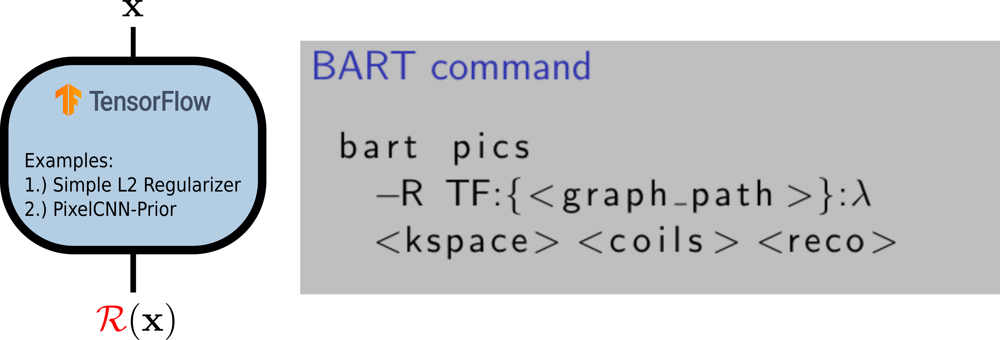

---
jupyter:
  jupytext:
    text_representation:
      extension: .md
      format_name: markdown
      format_version: '1.2'
      jupytext_version: 1.6.0
  kernelspec:
    display_name: Python 3
    language: python
    name: python3
---

<!-- #region id="11904043" -->
# Enhance BART with a TF Computation Graph

**Authors**: [Guanxiong Luo](mailto:guanxiong.luo@med.uni-goettingen.de), [Nick Scholand](mailto:nick.scholand@med.uni-goettingen.de), [Christian Holme](mailto:christian.holme@med.uni-goettingen.de)

**Presenter**: [Guanxiong Luo](mailto:guanxiong.luo@med.uni-goettingen.de)

**Institution**: University Medical Center Göttingen

**Reference**:
> Luo, G, Blumenthal, M, Uecker, M. Using data-driven image priors for image reconstruction with BART Proc. Intl. Soc. Mag. Reson. Med. 29 (2021) P.1756

## Overview
This tutorial is to present how to create a regularization term with tensorflow and use it for image reconstruction in [BART](https://github.com/mrirecon/bart).



## What we have
TensorFlow provides a C API that can be used to build bindings for other languages. 

1. BART src/nn/tf_wrapper.c

    * create tensors, create tf session

    * import the exported graph

    * restore the session from the saved model

    * get operation nodes from the graph

    * execute operation with session.run()


2. TensorFlow C Libraries [2.4.0](https://storage.googleapis.com/tensorflow/libtensorflow/libtensorflow-gpu-linux-x86_64-2.4.0.tar.gz)

3. A python program to export graph and weights (if any)

## What you can do with tf graph

> We can create the regularization term $R(x)$ with tf graph for image reconstruction (integrated in BART's `pics` tool).

$$\underset{x}{\arg \min}\ \|Ax-y\|^2+\lambda R(x)$$

## What you can learn here

1. simple example $R(x)=\|x\|^2$ without trainable weights

2. $R(x)=\log p(x, net(\Theta,x))$ with trainable weights $\Theta$, $net$ is represented as a prior [1]

[1] Luo, G, Zhao, N, Jiang, W, Hui, ES, Cao, P. MRI reconstruction using deep Bayesian estimation. Magn Reson Med. 2020; 84: 2246– 2261. https://doi.org/10.1002/mrm.28274
<!-- #endregion -->

## Part 0: Download Supporting Material


This tutorial requires additional data including radial k-space spokes, a trained model and some python functions. If you want to follow up this tutorial execute the following cell, which downloads the required files.

```python
# Download the required supporting materials
! wget -q https://raw.githubusercontent.com/mrirecon/bart-workshop/master/ismrm2021/bart_tensorflow/data.zip
! unzip data.zip
```

<!-- #region id="3b544b17" -->
## Part I: How to Create a TF Graph for BART

The first part of this tutorial is about creating a TF graph, which can be used with BART. Therefore, we need load some python libraries.
<!-- #endregion -->

```python id="d9a21c71"
import tensorflow.compat.v1 as tf
tf.disable_eager_execution()

import numpy as np
```

<!-- #region id="30b64c57" -->
### Step 1: Define Input $x$

We define a TF object for our input.
<!-- #endregion -->

```python id="d4d77905"
image_shape = [256, 256, 2]
batch_size = 1

# CAPI -> TF_GraphOperationByName(graph, "input_0")
# give name with input_0, ..., input_I 
x = tf.placeholder(tf.float32,
                   shape=[batch_size]+image_shape,
                   name='input_0')
v = tf.Variable(1.)
x = x * v
```

<!-- #region id="8e2719ae" -->
### Step 2: Define Output $R(x)=\|x\|^2$
<!-- #endregion -->

```python id="f2920129"
l2 = tf.nn.l2_loss(x)#/np.product(image_shape)/batch_size        #R(x)=|x|^2
# CAPI -> TF_GraphOperationByName(graph, "output_0") -> nlop forward
# give name with output_0, ..., output_I
output = tf.identity(tf.stack([l2, tf.ones_like(l2)], axis=-1), name='output_0') 
```

<!-- #region id="6e8f00fa" -->
### Step 3: Define the Gradient of $R(x)=\|x\|^2$
<!-- #endregion -->

```python id="2d24fc05"
grad_ys = tf.placeholder(tf.float32,
                         shape=[2],
                         name='grad_ys_0')

# CAPI -> TF_GraphOperationByName(graph, "grad_0") -> nlop adj
grads = tf.squeeze(tf.gradients(output, x, grad_ys), name='grad_0') 
```

<!-- #region id="88c848b3" -->
### Step 4: Export the Graph and Weights
<!-- #endregion -->

```python colab={"base_uri": "https://localhost:8080/"} id="b0acc0c0" outputId="097bcdc1-597e-44d1-dd6c-3f72af686631"
from utils import export_model
# export_model(model_path, exported_path, name, as_text, use_gpu):

export_model(None, "./", "l2_toy", as_text=False, use_gpu=False)
```

```python colab={"base_uri": "https://localhost:8080/"} id="49f7dc3f" outputId="e1ba81ad-466e-4025-cc2d-b1bd909b1052"
!ls
```

<!-- #region id="ce4a7796" -->
##  Part II: How to Use the TF Graph in BART
<!-- #endregion -->

<!-- #region id="f1bfbc28" -->
###  Step 1: Setup BART and TF
<!-- #endregion -->

#### TF C API

First we need to **download the TF C API**

```bash colab={"base_uri": "https://localhost:8080/"} id="1ea147d2" outputId="b9282bf9-f5cb-4cdd-d582-28f43aeafc5b"

# Download tensorflow c libraries
wget -q https://storage.googleapis.com/tensorflow/libtensorflow/libtensorflow-gpu-linux-x86_64-2.4.0.tar.gz
mkdir tensorflow && tar -C tensorflow -xvzf libtensorflow-gpu-linux-x86_64-2.4.0.tar.gz
```

and set the required environmental variables

```python colab={"base_uri": "https://localhost:8080/"} id="1cOk227HH3Vv" outputId="7a1d4b1c-d32b-4bbe-ed32-707b7e8f6c5b"
%env LIBRARY_PATH=/content/tensorflow/include 
%env LD_LIBRARY_PATH=/content/tensorflow/lib
%env TF_CPP_MIN_LOG_LEVEL=3
```

#### Download and Compile BART

```bash

# Install BARTs dependencies
apt-get install -y make gcc libfftw3-dev liblapacke-dev libpng-dev libopenblas-dev &> /dev/null

# Download BART version

[ -d /content/bart ] && rm -r /content/bart
git clone https://github.com/mrirecon/bart/ bart

[ -d "bart" ] && echo "BART branch ${BRANCH} was downloaded successfully."
```

After downloading BART we need to compile it. Make sure the flags

- `TENSORFLOW=1`
- `TENSORFLOW_BASE=../tensorflow/`,

which are required to intgrate TR graphs in BART, are set.

```bash

cd bart

# Switch to desired branch of the BART project
BRANCH=master
git checkout $BRANCH

# Define specifications 
COMPILE_SPECS=" PARALLEL=1
                TENSORFLOW=1
                TENSORFLOW_BASE=../tensorflow/"

printf "%s\n" $COMPILE_SPECS > Makefiles/Makefile.local

make &> /dev/null
```

After compilation of BART we need to set the required environmental variable: `TOOLBOX_PATH`

```python
%env TOOLBOX_PATH=/content/bart
```

Additionally, we add the compiled `bart` executable to our `PATH` variable

```python id="0RI9l6blElDF"
import os
os.environ['PATH'] = os.environ['TOOLBOX_PATH'] + ":" + os.environ['PATH']
```

<!-- #region id="743c3f4a" -->
### Step 2: Help Information for TF Graph in BART's `pics`

In the second step we have a look into the help for BART's regularization options for the `pics` tool.
<!-- #endregion -->

```python colab={"base_uri": "https://localhost:8080/"} id="1f613571" outputId="6429ff8b-7993-4dd9-c841-dbb152c5c843"
!bart pics -Rh
```

<!-- #region id="dd4b2e2a" -->
proximal operation on $R(x)$

$$\hat{x}=\underset{x}{\arg \min} \|x-v\|^2 + \lambda R(x)$$
<!-- #endregion -->

<!-- #region id="0e14c927" -->
### Step 3: Extract Radial Spokes and Compute Coil Sensitivities
<!-- #endregion -->

The dataset we downloaded above provides us with radial k-space data consisting of 160 spokes following a sampling scheme rotated by the 7th golden angle.

For this tutorial we will use the first 60 spokes and extract them from the original dataset.

```bash id="7942ccc3"

# Extract spokes from original dataset

spokes=60

bart extract 2 0 $spokes ksp_256 ksp_256_c
bart extract 2 0 $spokes traj_256 traj_256_c
```

To be able to exploit ESPIRiT for coil sensitivity estimation, we need to grid the non-Cartesian (radial) dataset. Instead of gridding it directly we use the internal gridding of the inverse `nufft` and project the result back into k-space with an `fft`.

```bash id="7ca46fd4"

# Grid non-Cartesian k-space data

bart nufft -i traj_256_c ksp_256_c zero_filled
bart fft $(bart bitmask 0 1) zero_filled grid_ksp

```

After gridding the radial dataset, we can use ESPIRiT to estimate the coil sensitivity maps.

```bash

# Estimate coil-sensitivities with ESPIRiT

bart ecalib -r20 -m1 -c0.0001 grid_ksp coilsen_esp
```

<!-- #region id="3fcd3a99" -->
## Example 1: $R(x)=\|x\|^2$
<!-- #endregion -->

Use the tf graph as an l2 regularization term, and compare with built-in l2.

```python id="334b8029"
!bart pics -i100 -R TF:{$(pwd)/l2_toy}:0.02 -d5 -e -t traj_256_c ksp_256_c coilsen_esp l2_pics_tf
```

```python id="4d9f2471"
!bart pics -l2 0.01 -e -d5 -t traj_256_c ksp_256_c coilsen_esp l2_pics
```

```python id="029c7626"
from utils import *
import matplotlib.pyplot as plt
fig, axis = plt.subplots(figsize=(8,4), ncols=2)
l2_pics = readcfl("l2_pics")
l2_pics_tf = readcfl("l2_pics_tf")

axis[0].imshow(abs(l2_pics), cmap='gray', interpolation='None')
axis[1].imshow(abs(l2_pics_tf), cmap='gray', interpolation='None')
axis[0].set_title("l2_pics")
axis[1].set_title("l2_pics_tf")
axis[0].axis('off')
axis[1].axis('off')
```

<!-- #region id="da05b37c" -->
## Example 2: $R(x)=\log p(x, net(x))$ 
<!-- #endregion -->

Use the trained prior as a regularization term

```python id="a34231d2"
!ls prior/
```

```python id="edc18970"
# generate weights for density compensation
writecfl("weights", gen_weights(60, 256))           
```

```python id="9b0b02b9"
!bart pics -i30 -R TF:{./prior/pixel_cnn}:8 -d5 -e -I -p weights -t traj_256_c ksp_256_c coilsen_esp w_pics_prior
```

```python id="7c32249b"
import matplotlib.pyplot as plt
pics_prior = readcfl("w_pics_prior")
fig, axis = plt.subplots(figsize=(12,4), ncols=3)

axis[0].imshow(abs(l2_pics), cmap='gray', interpolation='None')
axis[0].set_title("l2_pics")
axis[1].imshow(abs(l2_pics_tf), cmap='gray', interpolation='None')
axis[1].set_title("l2_pics_tf")
axis[2].imshow(abs(pics_prior), cmap='gray', interpolation='None')
axis[2].set_title("prior_pics")
axis[0].axis('off')
axis[1].axis('off')
axis[2].axis('off')

```

```python id="2f804e22"
! bash clean
```

```python

```
